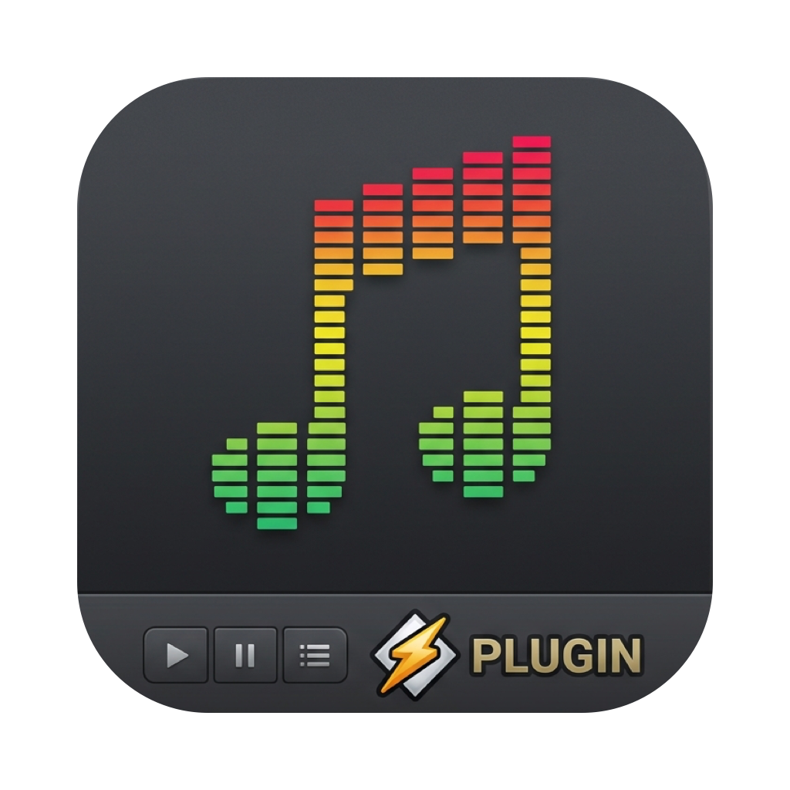

# MusicAmp

A Winamp 2-style player for Apple Music on macOS. It controls Music.app and draws classic Winamp `.wsz` skins,
with a real spectrum analyser, a 10-band equalizer and a playlist window.

## Requirements

- macOS 15 or later
- Apple's Command Line Tools (`xcode-select --install`). Xcode is not needed.

## Install

```sh
git clone https://github.com/anshxl/MusicAmp.git
cd MusicAmp
scripts/build-app.sh --install
```

This builds the app, copies it to `/Applications`, and opens it. Afterwards, start it like any app (Spotlight,
Launchpad), or turn on **Launch at Login** in its menu.

On first launch, macOS asks for two permissions. Allow both:

| Prompt | Needed for |
|---|---|
| Record system audio | The visualizer and the equalizer |
| Control "Music" | Playback, volume, playlists |

To change them later: System Settings > Privacy & Security > Screen & System Audio Recording, and > Automation.

**Update:** `git pull && scripts/build-app.sh --install`. macOS may ask for the audio permission again, because
each build gets a new ad-hoc signature.

## Use

| Action | How |
|---|---|
| Show or hide MusicAmp | **⌃⌥W** from any app, or the ♪ menu-bar item |
| Menu (skins, scale, windows, visualizer, album art, Launch at Login) | Right-click any window, or the ♪ menu-bar item |
| Change skin | Drop a `.wsz` file on the window. Thousands at [skins.webamp.org](https://skins.webamp.org) |
| Equalizer / playlist | **EQ** and **PL** buttons |
| Equalizer on/off, anti-clipping | **ON** and **AUTO** in the equalizer |
| Show another playlist | **LIST OPTS** in the playlist, or *Playlist Source* in the menu |
| Shade (fold a window to a strip) | Title-bar button, or double-click a title bar |
| Double size | **D** on the left edge of the main window, or **⌃D** |
| Visualizer mode | Click the visualizer |
| Album art | *Album Art Background* in the menu: the current cover, pixelated, behind the main window, and the visualizer in its colours |
| Time elapsed / remaining | Click the time |

Windows snap to screen edges and to each other. Windows touching the main window move with it.

Change the hotkey with `defaults write local.musicamp hotkey "cmd+shift+m"` and relaunch.

## Benchmarks

Apple M1, macOS 27.0.1, default skin, streaming a track from Apple Music. CPU is % of one core;
memory is the physical footprint.

| Scenario | CPU | Memory |
|---|---|---|
| Paused, main window | 2.6% | 24 MB |
| Playing, main window, visualizer off | 3.5% | 25 MB |
| Playing, main window, spectrum | 8% | 25 MB |
| Playing, all windows, EQ on, 1× | 9.6% | 25 MB |
| Playing, all windows, EQ on, 2× | 10.4% | 31 MB |
| Playing, all windows, EQ on, 3× | 10.8% | 41 MB |

The equalizer adds about 10–20 ms of latency and no resampling. With every slider at 0 dB, audio passes through unchanged.

## Notes

- The equalizer is MusicAmp's own, not Music's. While it is on, MusicAmp plays Music's audio through your output
  device. Tested with a DisplayPort monitor; other local outputs (built-in, USB, Bluetooth) should work.
  AirPlay does not. If MusicAmp quits, Music plays normally.
- Music's balance control does not exist, so the balance slider does nothing.

## Uninstall

```sh
rm -rf /Applications/MusicAmp.app
defaults delete local.musicamp
```

Turn off **Launch at Login** first if you enabled it.

## Development

```sh
swift build
.build/debug/MusicAmp --selftest   # EQ, skin parsing, album art, snapping and hotkey checks
.build/debug/MusicCtl              # Music.app control CLI (run without arguments for commands)
.build/debug/TapSpike              # audio tap test: prints level and spectrum of Music's output
```

## Credits

- Sprite coordinates and layout from [Webamp](https://github.com/captbaritone/webamp) by Jordan Eldredge (MIT).
- The default skin is the Winamp 2.91 base skin by Nullsoft, from the Webamp repository.
- App icon: `Support/AppIcon-source.jpg`, converted with `swift scripts/make-icon.swift`.
